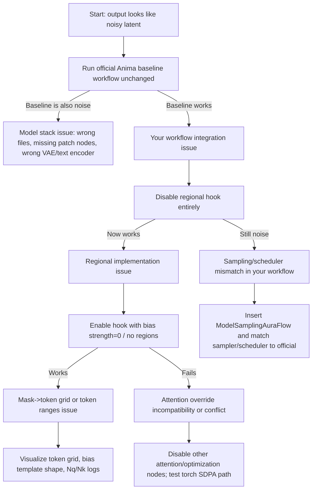

# Technical Diagnostic Report on Noisy Split Outputs from Regional Conditioning in Anima

## Executive summary

Your “pure noise with two slightly different halves” symptom is most consistent with **a fundamentally incorrect sampling configuration for Anima (a Cosmos-based model)**, where the diffusion model is being denoised with the wrong sampling wrapper / parameterization—so the “denoising” process largely fails and the VAE decodes something that still looks like structured noise. The **two-halves difference** is then explained by your regional-conditioning hook still **injecting a spatially varying bias** (so the latent statistics differ left vs. right), even though the underlying sampler/model configuration is not producing coherent images. citeturn4view0turn17view0turn10view0

The single most actionable fix is to **patch your workflow to match the official Anima setup**, specifically by inserting and wiring the same **model sampling patch node used by the official workflow**—notably `ModelSamplingAuraFlow` with a non-default `shift` used in the model repo’s workflow—and ensuring **the patched model** is the one feeding **(a)** KSampler **and** **(b)** your “mask→token-grid” and “apply hook” nodes. citeturn17view0turn4view0

Second-order contributors that can independently create “noise-like” or “broken” outputs include: using an unsupported resolution (Anima preview is recommended around ~1MP), loading the wrong VAE/text encoder for the checkpoint, or running on a ComfyUI version where transformer hook passing has regressed/changed. citeturn4view0turn4view1turn5search13turn18search7

## What can be inferred from your attachments and what is unspecified

### Observations from the attached workflow and node pack

From the attached `anima-regional-comfy-nodes.zip`, the example workflow `examples/anima_regional_left_right_masks.json` is a **single-pass regional conditioning** implementation that:

- concatenates multiple prompt embeddings into one sequence and records token-index ranges per region
- converts input masks into a **token-grid** aligned to the model’s patch tokens
- builds a **cross-attention bias tensor** (per image-token × per text-token) and injects it through ComfyUI’s `optimized_attention_override`
- gates the effect by denoising progress (`start_percent`, `end_percent`) and optionally applies to cross-attention only

In the example workflow you provided, the model path strings are:
- UNet: `anima_diffusion.safetensors`
- text encoder: `anima_clip.safetensors` (via `CLIPLoader`, “stable_diffusion” type)
- VAE: `anima_vae.safetensors`

The workflow uses:
- resolution: 1024×1024 latent canvas
- sampler: Euler
- scheduler: “normal”
- steps: 40
- CFG: 4.5
- fixed seed: 1

These settings are *not obviously wrong on their own*, especially CFG/steps being close to the Anima card’s general recommendations. citeturn4view0

### Key unspecified details (explicitly not provided)

You did not specify (so they must be treated as unknown until confirmed):

- your exact **Anima checkpoint lineage** (preview/final, Cosmos-derived variant, repackaged vs. split-files naming)
- your **ComfyUI version and revision** (stable vs nightly), and whether core nodes are missing/changed
- **PyTorch** version, CUDA toolkit, and attention backend (xformers / FlashAttention / SageAttention / PyTorch SDPA)
- GPU model and dtype modes (fp16/bf16/fp8), and whether other nodes patch attention globally
- whether you are running **tiling** (TiledDiffusion/TiledVAE) or any optimization nodes that change attention, CFG, sigmas, or sampler behavior
- whether the noisy output image you attached was generated at **1024** (per example) or **2048** (your attached PNG is 2048×2048)

These environment variables matter because regional conditioning here depends on precise attention shapes and ComfyUI hook plumbing. citeturn10view0turn18search7turn5search13

## Most likely root causes of “pure noise with two different halves”

### Primary hypothesis: missing required sampling patch for Anima

**High-confidence diagnosis:** your left-right example workflow is almost certainly sampling Anima without the same **required model sampling patch** used by the official Anima workflows.

Evidence from the **official Anima repo workflow** (`anima_comparison.json`) shows that the Anima model is used with a **ModelSamplingAuraFlow** node (with a `shift` value set to **3.0**) before KSampler. citeturn17view0turn4view0

If a Cosmos/AuraFlow-derived model expects a particular sampling parameterization and you omit that patch, the sampler steps may not correspond to what the model was trained for—commonly producing outputs that remain “latent-noise-like” after the full denoising loop. Your regional attention bias can still slightly alter attention statistics across the left/right halves, which explains why the output is not *perfectly uniform* noise. citeturn17view0turn10view0

### Secondary hypothesis: using wrong (or mismatched) text encoder / VAE / file placement

The Anima model card describes a **specific file layout** and components for ComfyUI:

- diffusion model file in `ComfyUI/models/diffusion_models`
- a specific text encoder
- a specific VAE (Qwen Image VAE) citeturn4view0

Using a mismatched VAE can yield outputs that look like noisy textures even if the latent is partially denoised, because decoding assumes the wrong latent distribution (scale/statistics). This tends to produce “structured noise” rather than semantically meaningful images. citeturn4view0turn14search2

### Tertiary hypothesis: resolution out of the model’s effective regime

The Anima model card recommends the preview model be used around **~1MP** (examples: 1024×1024, 896×1152, 1152×896) and explicitly notes it is not great at higher resolutions yet. citeturn4view0turn4view1

If your attached PNG is representative (2048×2048 = 4MP), that is a plausible contributor to “noisy / incoherent” outputs—especially combined with missing sampling patches. citeturn4view1

### Other plausible causes that can mimic this symptom

The following are less likely than the sampling-patch issue given the “two halves” clue, but they should be ruled out with targeted tests.

| Possible cause | Typical symptom pattern | Why it could create “noisy halves” | Most direct fix |
|---|---|---|---|
| Attention override conflicts (two features writing `optimized_attention_override`) | Sudden quality collapse after enabling a specific node pack; sometimes works, sometimes not | If your override replaces another needed override (or vice versa), the attention kernel path can change in unexpected ways | Disable other attention/optimization node packs; ensure only one `optimized_attention_override` is active; prefer ComfyUI core/natively supported paths citeturn10view0turn5search13 |
| Wrong mask alignment (mask resized incorrectly vs latent tokens) | Region content “bleeds”, seams, or region prompts appear swapped | Mis-broadcast bias across token grid can push different halves in different directions, but shouldn’t fully prevent denoising | Visualize token grid; verify mask-to-token mapping and patch size calculations |
| Cross-attn vs self-attn misclassification | Regional prompting has no effect, or effect is chaotic | Some DiT-like blocks have Nq==Nk even when conditioning is conceptually “cross” | Ensure the hook targets the correct attention path; add debug logging for Nq/Nk and block type |
| Incorrect conditioning ranges after padding/stripping | Model ignores regional prompts or becomes unstable | Bias applied to wrong token ranges can scramble conditioning | Log token lengths and segment ranges; verify the concatenation procedure against the text encoder’s padding behavior |
| Framework/device dtype edge cases (fp8/fused attention) | NaNs, black images, or extremely unstable outputs | Bias addition in wrong dtype can overflow | Force attention to fp16/bf16; clamp/scale bias; test with baseline PyTorch attention citeturn10view0 |

## Debugging workflow and ablation tests

This section is designed to get you from “noise” → “root cause” in the fewest runs.

### Minimal decision flow (mermaid)



### Step zero: establish the known-good baseline (must do)

1. Download and run the **official Anima workflow** from the model repo (the card states the model is natively supported and provides workflows). citeturn4view0turn15view0  
2. Confirm you are using the recommended resolution regime (~1MP) and the model’s recommended general settings (30–50 steps; CFG 4–5). citeturn4view0turn4view1  
3. Confirm that the workflow includes the same sampling patch node used in the official JSON (notably `ModelSamplingAuraFlow` in the provided repo workflow). citeturn17view0  

If the official workflow is also noise: treat this as a **model installation/config problem**, not a regional conditioning bug.

### Ablation tests to isolate the fault line

Run these tests in order (each is fast and narrows the search):

**Test A: regional off-switch**  
Use the same Anima workflow you’re testing, but bypass your `AnimaApplyRegionalAttentionHook` node so no `optimized_attention_override` is set.
- If it becomes normal: your hook is the trigger.
- If it stays noise: your sampler/model patch chain is wrong.

**Test B: sampling patch insertion (most important)**  
Insert the same sampling patch node used by the official Anima workflow:
- `UNETLoader` → `ModelSamplingAuraFlow(shift=3.0)` → KSampler  
and also feed that patched model to your regional nodes:
- patched model → `AnimaMaskToTokenGrid.model`
- patched model → `AnimaApplyRegionalAttentionHook.model`

This is the most common integration mistake: patching only the sampler path but leaving your regional code deriving patch size / token geometry from the unpatched model object. The official repo workflow demonstrates the presence of `ModelSamplingAuraFlow` in the chain. citeturn17view0

**Test C: sampler/scheduler parity with official workflow**  
Match the official Anima workflow’s sampling choices as closely as possible. The model card recommends samplers like `er_sde`, `euler_a`, and `dpmpp_2m_sde_gpu`, and the official workflow uses `er_sde` in at least one configuration. citeturn4view0turn17view0

**Test D: resolution sanity**  
Run at 1024×1024 first. If your output image is 2048×2048, bring it back to ~1MP, since the preview model is explicitly weaker at higher resolution. citeturn4view0turn4view1

**Test E: visualize the conditioning math**  
Enable your node’s “debug shapes” (if present) and log:
- attention call shapes (q/k/v, heads)
- computed bias_template shape (Nq × Nk)
- whether Nq/Nk mismatches cause bias skip
- min/max of bias, and whether any NaNs occur

ComfyUI’s attention override mechanism is explicitly implemented by wrapping attention calls and dispatching to `transformer_options["optimized_attention_override"]` when present. If your override is being called at all, you should be able to log that at the first attention invocation. citeturn10view0

### Minimal reproducible “scripted run” via ComfyUI API

If you want a reproducible harness (useful for regression testing), you can run ComfyUI headlessly and submit a workflow JSON:

```bash
# Start ComfyUI
python main.py --listen 127.0.0.1 --port 8188
```

```python
# send_workflow.py
import json, requests

with open("anima_regional_left_right_masks_FIXED.json", "r", encoding="utf-8") as f:
    workflow = json.load(f)

resp = requests.post("http://127.0.0.1:8188/prompt", json={"prompt": workflow})
resp.raise_for_status()
print(resp.json())
```

This doesn’t fix the bug by itself, but it makes “A/B changes” (like adding `ModelSamplingAuraFlow`) unambiguous and repeatable. citeturn18search7

## Actionable fixes and recommended parameter ranges

### Fix the workflow wiring to include the sampling patch

**What to change (conceptually):**

**Incorrect (current example style):**
```
UNETLoader ───────────► KSampler
UNETLoader ─► regional nodes (mask->token grid, apply hook)
```

**Correct (align with official Anima):**
```
UNETLoader ─► ModelSamplingAuraFlow(shift=3.0) ─► KSampler
                    └──────────────────────────► regional nodes
```

This aligns your workflow with the **official Anima workflow JSON**, which uses `ModelSamplingAuraFlow` before sampling. citeturn17view0

### Align sampler and scheduler with Anima guidance

Start from the model card’s guidance (preview model):
- **Resolution:** ~1MP (1024×1024, 896×1152, 1152×896) citeturn4view0  
- **Steps:** 30–50 citeturn4view0  
- **CFG:** 4–5 citeturn4view0  
- **Sampler candidates:** `er_sde`, `euler_a`, `dpmpp_2m_sde_gpu` citeturn4view0  

Regional conditioning often benefits from slightly more steps (because you are constraining attention and may reduce “free” mixing early), so a practical starting point is:
- steps: 40–60
- cfg: 3.5–5.0 (avoid going high until it works)

General diffusion guidance-scale behavior: higher CFG strengthens prompt adherence but can degrade/saturate outputs, so treat CFG increases as a quality-risk knob. citeturn13search0turn13search1

### Recommended regional-conditioning parameters (initial ranges)

These are pragmatic ranges to start debugging reliably:

- **Bias mode:** `soft_log` (more forgiving than hard masking)
- **eps:** 1e-4 to 1e-3 (too small can make effectively “hard” suppression)
- **start_percent / end_percent:** start at ~0.15–0.35, end at 1.0  
  - If you force strict region binding from step 0, some models become compositionally unstable.
- **normalize_overlaps:** true if you have overlap regions; false otherwise
- **unmasked_to_base:** true (ensures non-covered pixels still get “global” prompt guidance)

These selections are consistent with the idea of gating guidance during denoising and avoiding overly hard constraints too early. (This is an inference from diffusion behavior; gating itself is not a standardized requirement.) citeturn13search1

### Seed handling for reproducible debugging

Use a fixed seed while debugging and only change one variable at a time. In diffusion systems, the initial noise tensor is seed-driven, and tools like a `torch.Generator` are a standard way to ensure reproducible noise initialization when testing. citeturn13search3

## Reference implementations and alignment diagrams

### Correct vs incorrect mask-to-token alignment

Your goal is: **pixel mask → latent grid → patch token grid → attention bias**.

A simplified alignment diagram:

```
Pixel space (H x W)              Latent space (h x w)             Token grid (htok x wtok)
┌──────────────┐                 ┌──────────────┐                ┌──────────────┐
│ LEFT | RIGHT │  downsample →   │ left| right  │ pool patches → │ LLLL|RRRR     │
└──────────────┘                 └──────────────┘                └──────────────┘

Then flatten token grid (htok*wtok = Nq) and build bias (Nq x Nk_text_tokens)
```

If the mask is resized incorrectly (wrong aspect, wrong origin, off-by-one in width split), you will see:
- seams that do not correspond to the intended boundary
- “region swap” (left prompt affecting right)
- or inconsistent bleeding

### Canonical tensor shapes for cross-attention bias injection

ComfyUI’s attention wrapper calls an override when `transformer_options["optimized_attention_override"]` exists. citeturn10view0

A robust override should handle these shapes:

- Query/key/value are typically either:
  - **packed:** `(B, Sq, H*D)` with `heads=H` (skip_reshape=False)
  - **explicit heads:** `(B, H, Sq, D)` (skip_reshape=True)

- Attention similarity: `sim` should become `(B, H, Sq, Sk)`

Your **regional bias** should be broadcastable to that same shape:
- safest: `(1, 1, Sq, Sk)` and rely on broadcasting

Then:
- `sim = sim + bias`
- plus any existing `mask`/attention bias ComfyUI passes through

### Minimal “correct application” snippet for bias broadcasting and resizing

This is intentionally generic; adapt to your codebase:

```python
import torch
import torch.nn.functional as F

def resize_mask_to_tokens(mask_hw: torch.Tensor, htok: int, wtok: int, mode="area"):
    """
    mask_hw: (H, W) float in [0,1]
    returns: (htok, wtok) float in [0,1]
    """
    m = mask_hw[None, None]  # (1,1,H,W)
    m = F.interpolate(m, size=(htok, wtok), mode=mode, align_corners=False if mode in ("bilinear","bicubic") else None)
    return m[0,0].clamp(0,1)

def build_bias(token_weights: torch.Tensor, token_ranges, total_tokens: int, eps=1e-4):
    """
    token_weights: (R, Nq) in [0,1] for R regions, flattened token grid
    token_ranges: list of (start,end) indices into the concatenated text tokens
    returns: bias (1,1,Nq,total_tokens)
    """
    R, Nq = token_weights.shape
    bias = torch.zeros((1,1,Nq,total_tokens), dtype=torch.float32)

    for r,(start,end) in enumerate(token_ranges):
        w = token_weights[r].clamp_min(eps).log()  # soft_log
        bias[0,0,:,start:end] = w[:,None]  # broadcast over region token span

    return bias  # broadcastable to (B,H,Nq,Sk)
```

If you inject bias but your sampler is misconfigured, you can still get “different noise halves” because `bias` can systematically change attention even when the model never converges to a clean sample.

## Common pitfalls checklist including the attributes you requested

### Model architecture and checkpoint compatibility

- Ensure you are using the correct **Anima diffusion model + compatible encoder + compatible VAE**, as the model card spells out the expected components and directories. citeturn4view0  
- Use the official workflow as the compatibility oracle; it is explicitly provided for ComfyUI usage. citeturn4view0turn15view0  

### Conditioning method and map format

- Masks should be float in [0,1], and you must define whether you want:
  - hard 0/1 regions (nearest / max-pool)
  - soft transitions (bilinear / area)
- If masks overlap, normalize weights or define priority rules; otherwise overlapping regions can sum to >1 and skew bias.

### Preprocessing, resizing, and normalization

- Always resize masks **in the same coordinate convention** as your model/latent:
  - top-left origin is the typical convention in ComfyUI’s area-based conditioning examples. citeturn2view0turn3search7  
- Binary masks: prefer nearest or max-pool to avoid fractional edges.
- Soft masks: area pooling is often more stable than bilinear because it preserves total “coverage” when downsampling.

### Latent vs pixel conditioning

- Your method is **latent/token-space conditioning** (via attention bias), not pixel-space blending.
- A pixel-space mask used after decoding (alpha blend of two decoded images) will not “bind” objects the way cross-attention bias does.

### Loss functions and training vs inference mode

- If you are only doing inference: loss functions are irrelevant.
- If you fine-tuned any part (LoRA, adapter, regional module), ensure:
  - `model.eval()`
  - no dropout in conditioning path
  - you trained with the correct diffusion objective (noise-prediction or model-specific parameterization); DDPM-style training is typically framed as a denoising/noise-prediction objective. citeturn14search0  

### Scheduler/denoising steps and guidance scale

- For Anima preview: start 30–50 steps, CFG 4–5, ~1MP resolution, as explicitly recommended. citeturn4view0  
- Increasing CFG generally increases adherence but can hurt quality; treat it as a controlled variable when debugging. citeturn13search0turn13search1  

### Seed handling

- Fix seed during debugging; only vary after functionality is confirmed.
- Reproducibility depends on controlling the RNG used for initial noise; this is a documented best practice in diffusion pipelines. citeturn13search3  

### Tiling/patching and blending/alpha masks

- Avoid tiled diffusion/latent tiling while debugging regional conditioning: tiles can change token indexing and introduce seams that look like “regional failures.”
- If you must tile at high res, first validate that:
  - token grid mapping is computed per-tile consistently, or
  - you compute global bias and then apply it per tile with correct cropping.

### Upscaling/postprocessing

- For Anima preview, generate around ~1MP and upscale afterward rather than generating 4MP directly, because higher-res behavior is a known limitation of the preview checkpoint. citeturn4view1  

### Framework versions and device quirks

- ComfyUI’s core moves quickly; custom nodes that depend on transformer hooks can break if you are not aligned with the expected hook plumbing (ComfyUI documents models and encourages staying updated for new core nodes). citeturn18search7turn18search1  
- The attention override mechanism is explicitly implemented in ComfyUI core via `transformer_options["optimized_attention_override"]`. If the override key or call signature changes, your node can silently misbehave or stop applying. citeturn10view0  
- The ComfyUI changelog indicates that transformer_options handling has had regressions/fixes in the past (so pinning versions during development is prudent). citeturn5search13